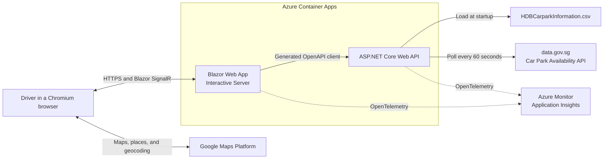

# Smart Parking Navigator

Smart Parking Navigator is a mobile-first web application for finding suitable
HDB car parks near a destination in Singapore. It combines static HDB car park
information with live lot availability to search within 500 metres, filter by
vehicle type and parking conditions, rank compatible options, and show nearby
alternatives when a car park is full.

> [!NOTE]
> The P0 parking-search experience is implemented, including live availability,
> destination and current-location search, Google Maps, filtering, ranking,
> details, alternatives, manual refresh, Aspire composition, and generated
> OpenAPI clients. Post-P0 performance, browser-compatibility, accessibility,
> observability, and production-deployment gates remain before an MVP release.

## Architecture



The solution uses:

- **.NET 10** and **.NET Aspire** for application composition and observability.
- **Blazor Web App** with Interactive Server render mode.
- **ASP.NET Core Web API** for data ingestion, search, and recommendations.
- **Microsoft Fluent UI Blazor** for the user interface.
- **OpenAPI-first** frontend/backend communication.
- **xUnit v3**, **bUnit**, and Aspire hosting tests for automated testing.
- **Azure Container Apps** as the approved deployment target.

## Prerequisites

### Local application development

- [.NET 10 SDK](https://dotnet.microsoft.com/download/dotnet/10.0)
- A Chromium-family browser
- A [Google Cloud project](https://console.cloud.google.com/) with billing
  enabled for a standard Google Maps Platform key
- A data.gov.sg API key
- A container runtime supported by Aspire for packaging or Azure deployment

### Google Maps API key

Google Maps Platform requires an API key for authentication and billing.

1. Create or select a project in the
   [Google Cloud console](https://console.cloud.google.com/).
2. Enable billing for the project.
3. Enable the
   [Maps JavaScript API](https://console.cloud.google.com/google/maps-apis/api-list),
   **Places API (New)**, and Geocoding API. Places text search supplies named
   destination choices, Places nearby search names a selected map area, and
   geocoding provides the address fallback.
4. Create an API key from
   [Google Maps Platform credentials](https://console.cloud.google.com/google/maps-apis/credentials).
5. Add **Website** application restrictions for the local and deployed origins,
   for example `https://localhost:*` during development and the production
   application origin after deployment.
6. Add API restrictions so the key can call only the enabled Maps APIs.

The browser must receive the Maps JavaScript API key, so the key cannot be
treated as a confidential server secret. Protect it with website and API
restrictions, monitor its usage, and never commit it to the repository. See
[Google's API security best practices](https://developers.google.com/maps/api-security-best-practices).

The AppHost reads `GoogleMaps:ApiKey` and supplies it to WebApp as
`GoogleMaps__ApiKey`. Store it with the AppHost's development secrets:

```powershell
dotnet user-secrets set "GoogleMaps:ApiKey" "<your-restricted-api-key>" `
  --project src\CarparkAvailability.AppHost
```

### Azure deployment

- An active [Azure subscription](https://azure.microsoft.com/free/)
- [Azure Developer CLI (`azd`)](https://learn.microsoft.com/azure/developer/azure-developer-cli/install-azd)
- Permission to create resource groups, Azure Container Apps, Azure Container
  Registry, Log Analytics, Application Insights, and managed identities

The planned GitHub Actions deployment will use OpenID Connect workload identity
rather than a long-lived Azure client secret.

## Getting Started

### Local development

1. Clone the repository and enter its directory.
2. Configure the external API keys in the AppHost user-secrets store:

   ```powershell
   dotnet user-secrets set "GoogleMaps:ApiKey" "<your-restricted-api-key>" `
     --project src\CarparkAvailability.AppHost
   dotnet user-secrets set "DataGovSg:ApiKey" "<your-data-gov-sg-api-key>" `
     --project src\CarparkAvailability.AppHost
   ```

3. Restore, build, and test the solution:

   ```powershell
   dotnet restore CarparkAvailability.slnx
   dotnet build CarparkAvailability.slnx --no-restore --configuration Release
   dotnet test CarparkAvailability.slnx --no-build --configuration Release
   ```

4. Run the Aspire AppHost:

   ```powershell
   dotnet run --project src\CarparkAvailability.AppHost
   ```

5. Open the Aspire dashboard URL printed in the terminal.

The AppHost starts ApiApp and WebApp, injects their external-service
configuration, connects WebApp to ApiApp through Aspire service discovery, and
opens both services in the Aspire dashboard. WebApp is the browser-facing
resource.

### Azure deployment

`azure.yaml`, `aspire.config.json`, the AppHost Container Apps topology, and the
tracked deployment plan are prepared. The plan in
`.azure/deployment-plan.md` records the current validation status and blockers.
No separately maintained Bicep files are required.

After all validation blockers are resolved and deployment is explicitly
approved:

```powershell
azd auth login
azd env new
azd provision --preview
azd up
```

`azd provision --preview` must be reviewed before provisioning changes.
`azd up` provisions the AppHost-defined Azure resources and deploys the
application. The deployment output provides the public WebApp URL.

The current GitHub Actions workflow restores the solution, generates both NSwag
clients, builds in Release, and runs all test projects. Browser testing,
container scanning, and automated deployment remain post-P0 pipeline work.

See
[Deploy an Aspire project to Azure Container Apps](https://learn.microsoft.com/dotnet/aspire/deployment/azure/aca-deployment)
for the platform workflow.

## Repository Structure

```text
/
|-- .azure/
|   `-- deployment-plan.md                    # Tracked deployment status
|-- contracts/                              # Internal OpenAPI source of truth
|-- data/                                   # Versioned HDB static data
|-- src/
|   |-- CarparkAvailability.ApiApp/         # ASP.NET Core Web API
|   |-- CarparkAvailability.AppHost/        # Aspire orchestration
|   |-- CarparkAvailability.ServiceDefaults/ # Shared telemetry and resilience
|   `-- CarparkAvailability.WebApp/         # Blazor Web App
|-- test/
|   |-- CarparkAvailability.ApiApp.Tests/
|   |-- CarparkAvailability.AppHost.Tests/
|   `-- CarparkAvailability.WebApp.Tests/
|-- aspire.config.json
|-- azure.yaml
|-- IDEATION.md
|-- PRD.md
`-- TRD.md
```

## Further Reading

- [Product Requirements Document](PRD.md)
- [Technical Requirements Document](TRD.md)
- [Initial Product Ideation](IDEATION.md)
- [.NET Aspire documentation](https://aspire.dev/)
- [ASP.NET Core Blazor render modes](https://learn.microsoft.com/aspnet/core/blazor/components/render-modes)
- [ASP.NET Core OpenAPI](https://learn.microsoft.com/aspnet/core/fundamentals/openapi/overview)
- [Microsoft Fluent UI Blazor](https://www.fluentui-blazor.net/)
- [xUnit.net v3 documentation](https://xunit.net/docs/getting-started/v3/getting-started)
- [Playwright for .NET](https://playwright.dev/dotnet/)
- [Maps JavaScript API](https://developers.google.com/maps/documentation/javascript)
- [Azure Developer CLI](https://learn.microsoft.com/azure/developer/azure-developer-cli/)

## Data Acknowledgement

This project uses:

- [Car Park Availability](https://data.gov.sg/datasets?formats=API&sort=relevancy&resultId=d_ca933a644e55d34fe21f28b8052fac63)
- [HDB Car Park Information](https://data.gov.sg/datasets/d_23f946fa557947f93a8043bbef41dd09/view)

Contains information from **Car Park Availability** and **HDB Car Park
Information**, accessed on 11 August 2026 from
[data.gov.sg](https://data.gov.sg/), which is made available under the terms of
the
[Singapore Open Data Licence version 1.0](https://data.gov.sg/open-data-licence).

The datasets are provided on an "as is" and "as available" basis. This project
is not endorsed by data.gov.sg, HDB, or the Singapore Government.

## Contributing

See [CONTRIBUTING.md](CONTRIBUTING.md) for development and pull request
guidelines.

## Security

See [SECURITY.md](SECURITY.md) to report a vulnerability privately.

## Licence

The project source code is licensed under the [MIT License](LICENSE). Data
remains subject to the Singapore Open Data Licence described above.
