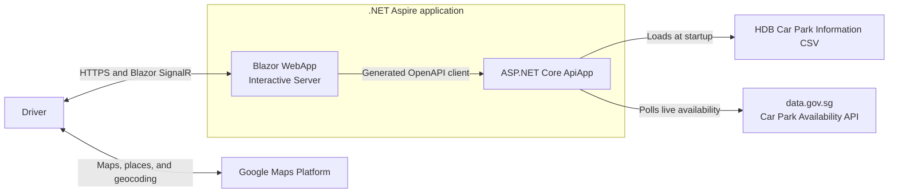

# Smart Parking Navigator

Smart Parking Navigator is a mobile-first web application that helps drivers find suitable HDB car parks near a destination in Singapore. It combines static car park information with live lot availability to support filtering, ranking, and nearby alternatives.

## Architecture Diagram



## Project Directory Structure

```text
/
├── .azure
│   └── deployment-plan.md
├── .github
│   ├── ISSUE_TEMPLATE
│   └── workflows
├── contracts
├── data
├── docs
├── src
│   ├── CarparkAvailability.ApiApp
│   ├── CarparkAvailability.AppHost
│   ├── CarparkAvailability.ServiceDefaults
│   └── CarparkAvailability.WebApp
├── test
│   ├── CarparkAvailability.ApiApp.Tests
│   ├── CarparkAvailability.AppHost.Tests
│   └── CarparkAvailability.WebApp.Tests
├── AGENTS.md
├── CarparkAvailability.slnx
├── CONTRIBUTING.md
├── IDEATION.md
├── PRD.md
├── TRD.md
├── aspire.config.json
└── azure.yaml
```

## Prerequisites

- [Visual Studio 2026](https://visualstudio.microsoft.com/downloads/) or [VS Code](https://code.visualstudio.com/download) with [C# Dev Kit](https://marketplace.visualstudio.com/items?itemName=ms-dotnettools.csdevkit)
- [.NET 10 SDK](https://dotnet.microsoft.com/download/dotnet/10.0)
- [Docker Desktop](https://docs.docker.com/get-started/get-docker/) or similar local container management tool
- [Azure CLI](https://learn.microsoft.com/cli/azure/install-azure-cli)
- [Azure Developer CLI](https://learn.microsoft.com/azure/developer/azure-developer-cli/install-azd)
- [Aspire CLI](https://aspire.dev/get-started/install-cli/)
- A Chromium-family browser
- A Google Maps Platform API key configured as described in [Google Maps API Key Setup](docs/google-maps-api-key.md)
- A data.gov.sg API key configured as described in [data.gov.sg API Key Setup](docs/data-gov-sg-api-key.md)

## Getting Started

1. Clone the repository:

   ```bash
   git clone https://github.com/devkimchi/smart-parking-navigator.git
   cd smart-parking-navigator
   ```

1. Configure both external API keys by following the setup guides linked in the prerequisites.

1. Restore, build, and test the solution:

   ```bash
   dotnet restore CarparkAvailability.slnx
   dotnet build CarparkAvailability.slnx --no-restore --configuration Release
   dotnet test CarparkAvailability.slnx --no-build --configuration Release
   ```

1. Run the application through the Aspire AppHost:

   ```bash
   aspire run
   ```

5. Open the Aspire dashboard URL printed in the terminal, then open the WebApp resource.

## Further Reading

### Product

- [Initial Product Ideation](IDEATION.md)
- [Product Requirements Document](PRD.md)
- [Technical Requirements Document](TRD.md)
- [Google Maps API Key Setup](docs/google-maps-api-key.md)
- [data.gov.sg API Key Setup](docs/data-gov-sg-api-key.md)

### Tools

- [.NET Aspire documentation](https://aspire.dev/)
- [ASP.NET Core Blazor render modes](https://learn.microsoft.com/aspnet/core/blazor/components/render-modes)
- [ASP.NET Core OpenAPI](https://learn.microsoft.com/aspnet/core/fundamentals/openapi/overview)
- [Microsoft Fluent UI Blazor](https://www.fluentui-blazor.net/)
- [xUnit.net v3 documentation](https://xunit.net/docs/getting-started/v3/getting-started)
- [Playwright for .NET](https://playwright.dev/dotnet/)
- [Maps JavaScript API](https://developers.google.com/maps/documentation/javascript)
- [Azure Developer CLI](https://learn.microsoft.com/azure/developer/azure-developer-cli/)

## Data Acknowledgement

This project uses:

- [Car Park Availability](https://data.gov.sg/datasets?formats=API&sort=relevancy&resultId=d_ca933a644e55d34fe21f28b8052fac63)
- [HDB Car Park Information](https://data.gov.sg/datasets/d_23f946fa557947f93a8043bbef41dd09/view)

Contains information from **Car Park Availability** and **HDB Car Park Information**, accessed on 11 August 2026 from [data.gov.sg](https://data.gov.sg/), which is made available under the terms of the [Singapore Open Data Licence version 1.0](https://data.gov.sg/open-data-licence).

The datasets are provided on an "as is" and "as available" basis. This project is not endorsed by data.gov.sg, HDB, or the Singapore Government.
