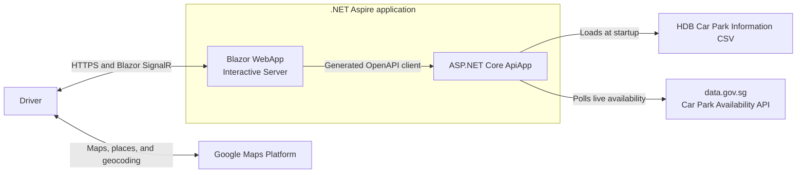

# Smart Parking Navigator

Smart Parking Navigator is a mobile-first web application that helps drivers
find suitable HDB car parks near a destination in Singapore. It combines static
car park information with live lot availability to support filtering, ranking,
and nearby alternatives.

## Architecture Diagram



## Project Directory Structure

```text
.
├── .azure
│   └── deployment-plan.md
├── .github
│   ├── ISSUE_TEMPLATE
│   └── workflows
├── contracts
├── data
├── docs
├── src
│   ├── CarparkAvailability.ApiApp
│   ├── CarparkAvailability.AppHost
│   ├── CarparkAvailability.ServiceDefaults
│   └── CarparkAvailability.WebApp
├── test
│   ├── CarparkAvailability.ApiApp.Tests
│   ├── CarparkAvailability.AppHost.Tests
│   └── CarparkAvailability.WebApp.Tests
├── AGENTS.md
├── CarparkAvailability.slnx
├── CONTRIBUTING.md
├── IDEATION.md
├── PRD.md
├── TRD.md
├── aspire.config.json
└── azure.yaml
```

## Prerequisites for Local Development

- [Git](https://git-scm.com/)
- [.NET 10 SDK](https://dotnet.microsoft.com/download/dotnet/10.0)
- A Chromium-family browser
- A Google Maps Platform API key configured as described in
  [Google Maps API Key Setup](docs/google-maps-api-key.md)
- A data.gov.sg API key configured as described in
  [data.gov.sg API Key Setup](docs/data-gov-sg-api-key.md)

## Getting Started

1. Clone the repository:

   ```powershell
   git clone https://github.com/devkimchi/smart-parking-navigator.git
   cd smart-parking-navigator
   ```

2. Configure both external API keys by following the setup guides linked in the
   prerequisites.

3. Restore, build, and test the solution:

   ```powershell
   dotnet restore CarparkAvailability.slnx
   dotnet build CarparkAvailability.slnx --no-restore --configuration Release
   dotnet test CarparkAvailability.slnx --no-build --configuration Release
   ```

4. Run the application through the Aspire AppHost:

   ```powershell
   dotnet run --project src\CarparkAvailability.AppHost
   ```

5. Open the Aspire dashboard URL printed in the terminal, then open the WebApp
   resource.

## Further Reading

- [Product Requirements Document](PRD.md)
- [Technical Requirements Document](TRD.md)
- [Initial Product Ideation](IDEATION.md)
- [Contributing Guide](CONTRIBUTING.md)
- [Google Maps API Key Setup](docs/google-maps-api-key.md)
- [data.gov.sg API Key Setup](docs/data-gov-sg-api-key.md)
- [Security Policy](SECURITY.md)
- [MIT License](LICENSE)

## Data Acknowledgement

This project uses:

- [Car Park Availability](https://data.gov.sg/datasets?formats=API&sort=relevancy&resultId=d_ca933a644e55d34fe21f28b8052fac63)
- [HDB Car Park Information](https://data.gov.sg/datasets/d_23f946fa557947f93a8043bbef41dd09/view)

Contains information from **Car Park Availability** and **HDB Car Park
Information**, accessed on 11 August 2026 from
[data.gov.sg](https://data.gov.sg/), which is made available under the terms of
the
[Singapore Open Data Licence version 1.0](https://data.gov.sg/open-data-licence).

The datasets are provided on an "as is" and "as available" basis. This project
is not endorsed by data.gov.sg, HDB, or the Singapore Government.
