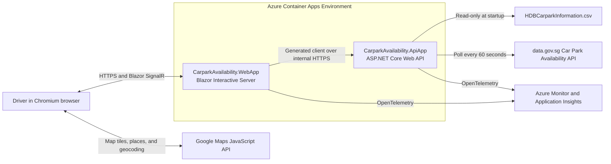

# Technical Requirements Document: Smart Parking Navigator

| Field | Value |
| --- | --- |
| Status | Approved |
| Version | 1.1 |
| Last updated | 2026-08-13 |
| Technical owner | TBD |
| Product requirements | [PRD.md](PRD.md), version 1.1 |
| Target platform | .NET 10, .NET Aspire, Azure Container Apps |
| Approval | P0 implementation decisions updated on 2026-08-13 |

## 1. Purpose

This document defines how the approved Smart Parking Navigator MVP will be
implemented, tested, deployed, and operated. It translates the product
requirements into technical components, contracts, data flows, quality gates,
and delivery milestones.

The TRD is the source of truth for implementation decisions. Product behavior
continues to be governed by the PRD. A change that alters user-visible scope or
acceptance criteria requires a PRD change; a change to implementation requires
this TRD or an Architecture Decision Record (ADR) update.

## 2. Scope and Delivery Constraints

### 2.1 P0 technical scope

- Blazor Web App using Interactive Server render mode
- ASP.NET Core Web API with an internal OpenAPI-first contract
- Google Maps JavaScript integration and browser geolocation
- Static HDB car park data loaded from the repository CSV file
- Live Car Park Availability polling from data.gov.sg
- SVY21-to-WGS84 conversion
- 500-metre geodesic search
- Vehicle-type compatibility, filtering, ranking, and alternatives
- Data freshness, partial-data, and failure handling
- .NET Aspire orchestration and Service Defaults
- Azure Container Apps deployment through Azure Developer CLI (`azd`)
- GitHub Actions CI/CD, including deployment
- xUnit unit and integration tests
- Playwright with xUnit for end-to-end tests

### 2.2 Deferred scope

- PRD P1 and P2 features
- User authentication and accounts
- Durable application database
- Historical availability persistence
- Multi-region deployment
- Multi-replica scaling
- API route versioning
- Native mobile applications

NFR-01 performance, NFR-06 compatibility, and NFR-08 accessibility are
implemented and validated after the P0 functional implementation, but before
MVP release. The architecture must not prevent those requirements from being
completed.

## 3. Technology Stack

| Area | Selection | Rationale |
| --- | --- | --- |
| Runtime | .NET 10 | Repository-pinned SDK and current application platform |
| Frontend | Blazor Web App, Interactive Server | Server-side .NET UI with a small browser payload and direct use of shared C# contracts |
| UI components | `Microsoft.FluentUI.AspNetCore.Components` | Fluent design system and accessible Blazor components |
| Backend | ASP.NET Core Web API | Typed HTTP boundary for search, detail, availability, and data status |
| Orchestration | .NET Aspire AppHost | Local composition, service discovery, health, and deployment model |
| Shared defaults | .NET Aspire Service Defaults | OpenTelemetry, health checks, service discovery, and HTTP resilience |
| API contract | OpenAPI-first YAML | Stable frontend/backend contract before implementation |
| Client generation | NSwag | Deterministic C# client generation for the WebApp |
| CSV parsing | `CsvHelper` | Standards-compliant streaming parser with explicit typed field mapping |
| Static data | Existing `data/HDBCarparkInformation.csv` | Approved P0 HDB source without a database |
| Live data | data.gov.sg Car Park Availability API | Approved real-time availability source |
| Map and destination discovery | Google Maps JavaScript API, Places API (New), and Geocoding API | Map rendering, named-place search, map-area naming, and address fallback |
| Unit and integration tests | xUnit | Common .NET test framework |
| End-to-end tests | Microsoft Playwright for .NET with xUnit | Browser-level verification of P0 journeys |
| Cloud hosting | Azure Container Apps | Container hosting compatible with Aspire and `azd` |
| CI/CD | GitHub Actions | Repository-native validation and deployment |
| Observability | OpenTelemetry and Azure Monitor/Application Insights | Aspire-compatible distributed telemetry |
| Infrastructure model | Aspire AppHost deployment model with `azd` | Keep application topology and Azure Container Apps configuration in C# without separately maintained Bicep files |

Package versions are centrally managed with approved major-version floating
ranges in `Directory.Packages.props`. Build settings and analyzers are shared
through `Directory.Build.props`.

## 4. Repository and Solution Structure

The complete target structure is:

```text
/
|-- .github/
|   `-- workflows/
|       `-- ci.yml
|-- contracts/
|   `-- carpark-availability-api.openapi.yaml
|-- data/
|   `-- HDBCarparkInformation.csv
|-- src/
|   |-- CarparkAvailability.ApiApp/
|   |-- CarparkAvailability.AppHost/
|   |-- CarparkAvailability.ServiceDefaults/
|   `-- CarparkAvailability.WebApp/
|-- test/
|   |-- CarparkAvailability.ApiApp.Tests/
|   |-- CarparkAvailability.AppHost.Tests/
|   `-- CarparkAvailability.WebApp.Tests/
|-- azure.yaml
|-- CarparkAvailability.slnx
|-- Directory.Build.props
|-- Directory.Packages.props
|-- global.json
|-- PRD.md
`-- TRD.md
```

### 4.1 Project responsibilities

| Project | Responsibility |
| --- | --- |
| `CarparkAvailability.ApiApp` | Load and normalize data, poll availability, search, filter, rank, and expose `/api` |
| `CarparkAvailability.AppHost` | Compose local services and publish the Aspire deployment model |
| `CarparkAvailability.ServiceDefaults` | Shared health checks, resilience, service discovery, and OpenTelemetry |
| `CarparkAvailability.WebApp` | Render the UI, integrate Google Maps through JavaScript interop, hold circuit-scoped UI state, and call the generated API client |
| `CarparkAvailability.ApiApp.Tests` | Domain unit tests, API integration tests, upstream contract tests, and internal OpenAPI conformance |
| `CarparkAvailability.AppHost.Tests` | Distributed application startup, resource wiring, health, and service-discovery tests |
| `CarparkAvailability.WebApp.Tests` | Component tests and Playwright/xUnit end-to-end journeys |

The MVP does not introduce separate class-library projects. Namespaces and
folders inside ApiApp isolate domain, application, infrastructure, and endpoint
code. A project is extracted only when an independently reusable boundary is
demonstrated.

## 5. Architecture

### 5.1 System context



### 5.2 Deployment topology

- WebApp has external HTTPS ingress and is the only public application service.
- ApiApp uses internal Container Apps ingress and is reachable only within the
  Container Apps environment.
- Both services listen on the same configured container target port, initially
  `8080`.
- WebSockets are enabled for the Blazor Interactive Server circuit.
- MVP scaling is one minimum and one maximum replica for both services.
  This avoids distributed in-memory state and Blazor circuit-affinity concerns.
- Post-P0 scaling requires validated session affinity or Azure SignalR for
  WebApp and a shared availability cache or leader-controlled poller for ApiApp.
- The recommended Azure region is Southeast Asia.

### 5.3 Local orchestration

AppHost registers ApiApp and WebApp. WebApp receives a service reference to
ApiApp and waits for its readiness endpoint. Only WebApp is externally exposed.
Service Defaults are applied to both services.

The AppHost is a development and deployment-model project; it is not deployed as
a third application container.

## 6. Component Design

### 6.1 ApiApp modules

```text
CarparkAvailability.ApiApp/
|-- Contracts/
|-- Domain/
|   |-- CarParks/
|   |-- Availability/
|   `-- Recommendations/
|-- Endpoints/
|-- Infrastructure/
|   |-- Csv/
|   |-- DataGovSg/
|   `-- Geospatial/
|-- Options/
|-- Services/
`-- Program.cs
```

| Module | Responsibility |
| --- | --- |
| CSV repository | Parse and validate the static HDB file into immutable normalized records |
| Availability client | Fetch and validate the data.gov.sg response |
| Availability refresh service | Poll on schedule and atomically replace the last-known-good snapshot |
| Car park catalog | Join static records and live availability by normalized identifier |
| Geospatial service | Convert SVY21 coordinates and calculate WGS84 distance |
| Compatibility service | Apply vehicle-type and operating-condition hard filters |
| Recommendation service | Rank viable results and select alternatives |
| API endpoints | Validate requests, map domain results to contract DTOs, and return Problem Details |

### 6.2 WebApp modules

```text
CarparkAvailability.WebApp/
|-- Components/
|   |-- Layout/
|   |-- Pages/
|   `-- Results/
|-- Services/
|-- State/
|-- wwwroot/
|   `-- js/
|       `-- googleMaps.js
`-- Program.cs
```

| Module | Responsibility |
| --- | --- |
| Search page | Coordinate destination, location, filters, map, and result list |
| Map JavaScript module | Load Google Maps, manage markers, and return selected WGS84 coordinates |
| Generated API client | Provide the only typed WebApp-to-ApiApp transport |
| Search state | Maintain circuit-scoped query, filters, results, selection, and loading/error state |
| Fluent UI components | Render controls, cards, dialogs, status, and responsive navigation |
| Reconnection experience | Explain transient Blazor circuit loss and allow retry |

## 7. OpenAPI-First Internal Contract

### 7.1 Contract ownership

`contracts/carpark-availability-api.openapi.yaml` is the source of truth for
communication between WebApp and ApiApp. It must be authored before endpoint or
UI integration work.

The internal contract is distinct from the upstream data.gov.sg OpenAPI
specification. The upstream specification governs ingestion; the internal
specification governs the application boundary.

Contract workflow:

1. Change and review the OpenAPI YAML.
2. Lint and validate it in CI.
3. Regenerate the C# WebApp client with NSwag.
4. Implement or update ApiApp endpoints.
5. Run internal contract-conformance and consumer tests.
6. Reject the change if generated output or tests are stale.

Generated code is placed under the WebApp intermediate output directory during
build and is not manually edited. The generation command is committed and the
NSwag version is controlled through central package management.

ApiApp separately generates its upstream transport client from
`data/CarparkAvailability.json`. Partial DTO extensions adapt documented
differences in representative v1 responses without replacing the generated
transport boundary.

### 7.2 API conventions

- Base path is `/api`.
- The MVP has no route or header versioning.
- Resource names are plural and lowercase.
- JSON uses `camelCase`.
- Timestamps use ISO 8601 UTC with an explicit offset.
- Enums use documented string values.
- Validation failures and errors use RFC 9457-compatible Problem Details.
- Unknown JSON response fields are tolerated by generated clients.
- Breaking contract changes require coordinated frontend/backend delivery and a
  TRD decision because no compatibility version exists.
- OpenAPI is exposed at `/openapi.json` outside production, and may be exposed
  in production only if approved.

### 7.3 MVP endpoints

| Method and path | Purpose |
| --- | --- |
| `GET /api/carparks` | Return filtered and ranked car parks within 500 metres of an origin |
| `GET /api/carparks/{carParkNumber}` | Return one car park with current availability and details |
| `GET /api/data-status` | Return source update, freshness, matching, and validation status |
| `POST /api/data-status/refresh` | Request a serialized availability refresh subject to the polling cooldown |

`GET /api/carparks` query parameters:

| Parameter | Type | Rule |
| --- | --- | --- |
| `latitude` | decimal, required | WGS84, `-90..90` |
| `longitude` | decimal, required | WGS84, `-180..180` |
| `vehicleType` | string, required | `car`, `heavyVehicle`, or `motorcycle` |
| `availableOnly` | boolean | Defaults to `false` |
| `nightParking` | boolean | Omitted means no night-parking filter |
| `carParkType` | repeated string | Values are drawn from normalized approved HDB types |

The server fixes the radius at 500 metres. The client cannot expand it for the
MVP.

### 7.4 HTTP behavior

| Status | Usage |
| --- | --- |
| `200` | Successful result, including an empty result collection |
| `400` | Invalid coordinate, enum, or filter |
| `404` | Requested car park does not exist |
| `429` | Defensive application throttling if introduced |
| `500` | Unexpected internal failure with no sensitive details |
| `503` | Required startup data is unavailable or a requested upstream refresh failed |

Upstream availability failure does not make the API unavailable when a
last-known-good snapshot exists. Responses carry their original source
timestamp and freshness state.

## 8. Domain and Data Model

### 8.1 Core types

| Type | Key fields |
| --- | --- |
| `CarPark` | `carParkNumber`, address, WGS84 coordinate, normalized type, parking system, night parking, decks, gantry height, basement |
| `LotAvailability` | lot type, total lots, available lots |
| `AvailabilitySnapshot` | source update time, retrieval time, lot records, validation summary |
| `CarParkSearchResult` | car park, distance metres, availability, occupancy, freshness, compatibility, rank explanation |
| `DataStatus` | last attempt, last success, source update, freshness, match count, validation error count |
| `ProblemDetails` | type, title, status, detail, trace identifier, field errors when applicable |

### 8.2 Value rules

- `carParkNumber` is trimmed and compared using ordinal,
  case-insensitive semantics.
- Numeric strings are parsed using invariant culture.
- Invalid numeric values remain unknown; they never become zero.
- Available lots greater than total lots invalidate that lot record.
- Unsupported lot types may be returned as `other` for display but cannot satisfy
  a selected supported vehicle type.
- Occupancy is `(total - available) / total` only when `total > 0` and all
  values are valid.
- Unknown, unmatched, or invalid required data excludes a record from
  recommendation but may allow it to appear as incomplete information.

### 8.3 Vehicle-type mapping

The ingestion layer maps upstream lot-type codes to:

- `car`
- `heavyVehicle`
- `motorcycle`
- `other`

The exact upstream code mapping is held in one tested mapper. A new code is
logged and mapped to `other` until its official meaning is confirmed.

## 9. Static HDB CSV Processing

The existing `data/HDBCarparkInformation.csv` is the P0 source of static HDB
data.

Build and runtime rules:

- ApiApp includes the file as content and copies it into the published container
  under a read-only `Data/` path.
- The source file remains version-controlled and is not downloaded at runtime.
- Updating HDB static data requires replacing the file, running validation, and
  deploying a new application revision.
- ApiApp loads the CSV once during startup into an immutable in-memory catalog.
- The parser validates required headers, duplicate identifiers, numeric fields,
  coordinates, and normalized enum values.
- A missing file, missing required header, or unusable catalog fails ApiApp
  readiness.
- Invalid individual rows are quarantined from recommendation, counted, and
  logged without exposing raw sensitive content.
- The parser uses a centrally pinned `CsvHelper` package. An explicit
  `ClassMap` maps named CSV headers to a raw row type; rows are streamed,
  validated, and normalized into domain records rather than loaded through
  column-position assumptions.
- `CsvHelper` owns CSV quoting, escaping, delimiters, and record parsing.
  Application code owns field mapping, normalization, domain validation,
  quarantine decisions, and telemetry.

Free- and short-term-parking fields are retained as raw source values but do not
drive filters or calculated status until the approved sources define their
semantics.

## 10. Live Availability Processing

### 10.1 Refresh lifecycle

ApiApp owns all upstream polling. Browsers and WebApp do not call data.gov.sg
directly. The generated client calls the official
`https://api.data.gov.sg/v1/transport/carpark-availability` endpoint.

1. A hosted background service starts after the static catalog is ready.
2. It performs an immediate fetch, then uses `PeriodicTimer` with a configurable
   60-second interval.
3. Overlapping refreshes are prohibited.
4. The HTTP response is checked against the upstream contract and domain rules.
5. A valid snapshot atomically replaces the previous immutable snapshot.
6. A failed fetch or invalid response records telemetry and retains the
   last-known-good snapshot.
7. Cancellation stops polling cleanly during container shutdown.

The same singleton refresh service handles scheduled and user-requested
refreshes. Manual requests share the overlap guard and a one-minute cooldown,
return the current status after success, and return `503` while preserving
last-known-good data when the upstream refresh fails.

Recommended outbound policy:

- Overall request timeout: 10 seconds
- At most two transient retries with exponential backoff and jitter
- Circuit breaker for repeated failures
- Respect upstream `Retry-After`
- No retry for contract-validation or other non-transient failures

### 10.2 Freshness

With a 60-second expected refresh:

- `fresh`: source update time is at most 120 seconds old
- `stale`: a valid snapshot exists but is older than 120 seconds
- `unavailable`: no valid snapshot exists

The response always includes source update time, retrieval time, and freshness.
The threshold is configuration, not a hard-coded UI rule.

### 10.3 Concurrency

The availability store exposes immutable snapshots. Readers do not lock while
searching. Refresh constructs a complete replacement before an atomic reference
swap so requests never observe a partially updated dataset.

## 11. Geospatial Design

### 11.1 Coordinate conversion

An isolated `Svy21CoordinateConverter` converts CSV `x_coord` and `y_coord` to
WGS84 latitude and longitude during startup.

- Conversion uses one documented algorithm and invariant units.
- Reference-point fixtures verify known Singapore coordinates.
- Converted coordinates outside configured Singapore bounds are invalid.
- Conversion errors quarantine the row and emit structured telemetry.

### 11.2 Distance

The API calculates straight-line geodesic distance with the Haversine formula.

- Earth radius is a named constant in metres.
- Search includes results whose calculated distance is `<= 500` metres.
- Distance is rounded only for display; filtering and ranking use the unrounded
  value.
- Stable identifier order breaks exact ranking ties.

## 12. Filtering and Recommendation

### 12.1 Processing order

1. Select static car parks within 500 metres.
2. Join current lot availability and exclude records without valid live data.
3. Apply vehicle-type compatibility.
4. Apply requested availability, night-parking, and car-park-type filters.
5. Classify incomplete, fresh, stale, and unavailable results.
6. Rank viable results.
7. Return excluded-reason metadata where the UI needs to explain incompatibility.

### 12.2 Hard exclusions

A car park is not recommended when:

- it is outside 500 metres;
- it has no lot type compatible with the selected vehicle type;
- a requested hard filter is not satisfied;
- required coordinates are invalid;
- availability is invalid or unavailable; or
- it is full when alternatives with verified availability are requested.

### 12.3 Ranking

The initial deterministic score is:

```text
distanceScore     = 1 - clamp(distanceMetres / 500, 0, 1)
availabilityScore = clamp(availableLots / 20, 0, 1)
occupancyScore    = 1 - occupancyRate

score = (0.50 * distanceScore)
      + (0.30 * availabilityScore)
      + (0.20 * occupancyScore)
```

Rules:

- Fresh, verified results rank ahead of otherwise equivalent stale results.
- Unavailable results are not recommended.
- The available-lot cap and weights are configuration with the listed defaults.
- Sorting is score descending, distance ascending, available lots descending,
  then `carParkNumber` ascending.
- The API returns contributing factors, not only the numeric score.
- Alternative selection uses the same algorithm after excluding the selected
  full car park.

Recommendation fixtures must lock expected ordering before weights are changed.
A weight change requires product review because it changes visible behavior.

## 13. Frontend Design

### 13.1 Render and communication model

- The WebApp uses Interactive Server render mode for all interactive P0 pages.
- The browser maintains a SignalR circuit with WebApp.
- WebApp calls ApiApp server-to-server through the generated NSwag client and
  Aspire service discovery.
- The browser calls Google Maps only through the dedicated JavaScript module.
- Named destinations use Places API (New) text search restricted to Singapore
  and return up to five selectable matches. Geocoding is the address fallback.
- Map-area searches use Places nearby search to name the center and reverse
  geocoding only when no nearby named place is available.
- No hand-written frontend HTTP DTO or API client is permitted.

### 13.2 Routes and state

| Route | Purpose |
| --- | --- |
| `/` | Destination search, current location, filters, synchronized map/list, and details |
| `/error` | Safe fallback for unhandled WebApp errors |

The MVP uses one primary route and a details panel or dialog. Search state is
scoped to the Blazor circuit and is not persisted after the session.

### 13.3 Responsive layout

- Viewports up to `450px` use the mobile layout.
- Viewports wider than `450px` use a responsive tablet or desktop layout without
  a 450px content-width cap. The desktop layout may show the map and result or
  detail panels side by side.
- The layout remains usable down to 360px for NFR-06.
- Touch targets, map controls, search, filters, list, and detail content must fit
  without horizontal scrolling.
- The map and result list share the available vertical space and provide an
  explicit control to switch emphasis on small screens.
- The map is the default small-screen view; the List control exposes the
  accessible result alternative.
- `Microsoft.FluentUI.AspNetCore.Components` supplies standard controls,
  typography, dialogs, progress, and status presentation.

### 13.4 Required states

Each PRD-required UI state has a dedicated component or explicit rendering
branch:

- loading;
- no destination match;
- no nearby car parks;
- no filtered results;
- full or incompatible car park;
- stale or unavailable data;
- partial record;
- Google Maps or upstream failure;
- location permission denied;
- current location outside Singapore in a focus-managed modal;
- multiple selectable destination matches;
- manual refresh in progress or failed; and
- Blazor circuit reconnecting or disconnected.

## 14. Configuration and Secrets

Configuration uses typed options validated at startup.

| Setting | Owner | Default or source |
| --- | --- | --- |
| Availability API base URL | ApiApp | Configuration |
| Availability poll interval | ApiApp | 60 seconds |
| Manual refresh cooldown | ApiApp | 60 seconds, shared with scheduled refresh |
| Freshness threshold | ApiApp | 120 seconds |
| Search radius | ApiApp | 500 metres, fixed for MVP |
| Ranking weights and cap | ApiApp | Section 12 defaults |
| CSV path | ApiApp | Published `Data/HDBCarparkInformation.csv` |
| ApiApp service URL | WebApp | Aspire service discovery |
| Google Maps browser key | WebApp/browser | Environment configuration with HTTP referrer restrictions |
| Azure Monitor connection | Both | Managed Azure environment configuration |

Secrets are never committed. If data.gov.sg requires a credential, Aspire
publishes its secret parameter as an Azure Container Apps secret and injects it
into ApiApp through a `secretRef`. The Google Maps browser key is expected to be
visible to the browser and is protected with application and API restrictions,
not treated as a confidential server secret.

Development secrets use .NET user secrets or local environment configuration.

## 15. Security and Privacy

- Azure Container Apps terminates public TLS; plaintext public ingress is
  disabled.
- ApiApp has internal ingress only.
- The MVP is anonymous and has no authorization boundary for end users.
- WebApp enables standard ASP.NET Core antiforgery and secure-cookie defaults.
- ApiApp validates all coordinates, filters, identifiers, and upstream data.
- GitHub Actions authenticates to Azure with OpenID Connect workload identity;
  no long-lived Azure client secret is stored.
- Workload managed identities receive least-privilege Azure RBAC.
- Container Registry anonymous pull is disabled.
- Precise user location remains in circuit memory only and is not persisted.
- Logs, traces, and analytics omit precise coordinates and Google Maps input
  text. Coarse operational dimensions may be used only after privacy review.
- Sanitized upstream discrepancy fixtures must not contain credentials or
  request identifiers.
- Dependencies and container images are scanned before deployment.

## 16. Reliability and Observability

### 16.1 Health

Service Defaults expose:

- `/alive` for process liveness;
- `/health` for readiness.

Both endpoints currently report process health through Service Defaults.
Static-catalog initialization fails startup explicitly when required data cannot
load. Live availability may report unavailable without failing process health so
the UI can communicate the correct state.

### 16.2 Telemetry

Both applications emit OpenTelemetry logs, metrics, and traces. Trace context
propagates from WebApp to ApiApp and through outbound availability requests.

Required metrics:

- availability refresh attempts, successes, failures, and duration;
- source and retrieval age;
- schema-validation failures;
- static row count and quarantined row count;
- static/live identifier match rate;
- search duration and result count;
- empty and no-verified-result searches;
- freshness state returned;
- API request duration, status, and exception count;
- Blazor circuit count, reconnects, and failures.

Alerts:

- schema validation failures exceed 1% over 15 minutes;
- match rate falls below the approved baseline;
- no successful availability refresh for more than five minutes;
- sustained API or WebApp 5xx responses;
- either Container App has no healthy replica.

Service Defaults exports OpenTelemetry through OTLP when an exporter endpoint is
configured. Azure Monitor/Application Insights export, the custom metrics above,
alerts, sampling, and retention policy remain Milestone 4 work.

## 17. Testing Strategy

Tests never call live Google Maps or data.gov.sg services.

### 17.1 ApiApp.Tests

Unit tests cover:

- CSV field mapping and validation;
- identifier normalization;
- numeric parsing;
- SVY21 conversion reference points;
- Haversine boundary behavior at 500 metres;
- lot-type mapping;
- occupancy and freshness;
- hard filters;
- ranking and deterministic tie-breaking;
- last-known-good refresh behavior.

Integration and contract tests use `WebApplicationFactory` and deterministic
HTTP fixtures to cover:

- every `/api` operation and Problem Details response;
- OpenAPI request and response examples;
- generated-client compatibility;
- upstream valid, additive, missing-field, wrong-type, timeout, and throttled
  responses;
- missing or malformed CSV startup behavior;
- partial and unmatched records;
- health endpoints and telemetry wiring.

### 17.2 AppHost.Tests

Aspire distributed application tests verify:

- AppHost starts all declared resources;
- WebApp resolves ApiApp through service discovery;
- dependency wait and health behavior;
- ApiApp is internal and WebApp is externally addressable;
- configuration references are present without exposing secret values.

### 17.3 WebApp.Tests

Component tests currently verify Fluent UI rendering, state transitions,
destination choices, current-location boundaries, map-area naming, manual
refresh, and generated-client compatibility. The pre-MVP Playwright suite will
verify:

- destination search and 500-metre results;
- current-location permission granted and denied;
- map/list selection synchronization using a deterministic map adapter;
- vehicle type and condition filters;
- fresh, stale, unavailable, and partial states;
- full-car-park alternatives;
- API and map failure recovery;
- Blazor reconnection presentation;
- 360px, 450px, and representative desktop viewports;
- keyboard and accessible-name behavior before MVP release.

The planned Playwright suite will run against the AppHost with stubbed external
integrations. Traces, screenshots, and videos will be retained only for failed
CI tests.

### 17.4 Test categories and gates

The following are target gates before MVP deployment; the current P0 workflow
implements contract generation, unit and integration tests, and AppHost tests.

| Category | Pull request | Main deployment |
| --- | --- | --- |
| OpenAPI lint and client freshness | Required | Required |
| Unit tests | Required | Required |
| ApiApp integration tests | Required | Required |
| AppHost tests | Required | Required |
| Playwright P0 smoke tests | Required | Required |
| Full Playwright suite | Optional on PR if duration requires; nightly | Required |
| Performance tests | Post-P0 | Required before MVP release |
| Compatibility matrix | Post-P0 | Required before MVP release |
| Accessibility suite and manual review | Post-P0 | Required before MVP release |

## 18. CI/CD and Azure Deployment

### 18.1 GitHub Actions workflow

The current P0 workflow restores `CarparkAvailability.slnx`, explicitly
generates both NSwag clients, builds in Release, and runs all xUnit projects on
pushes and pull requests targeting `main`.

Before MVP release, it evolves into dependency-ordered jobs:

1. **contract**
   - validate the OpenAPI YAML;
   - generate the NSwag client;
   - fail on nondeterministic or stale generated output.
2. **build-test**
   - restore with locked dependencies;
   - build in Release;
   - run unit, API integration, and AppHost tests;
   - publish test and coverage results.
3. **e2e**
   - install pinned Playwright Chromium;
   - start the AppHost with stub integrations;
   - run P0 browser tests;
   - upload failure artifacts.
4. **package**
   - publish both application containers;
   - scan images and dependencies;
   - identify artifacts by immutable commit SHA.
5. **deploy**
   - run only after all required jobs succeed;
   - authenticate to Azure through GitHub OIDC;
   - preview the Aspire deployment model and proposed Azure changes;
   - provision the AppHost-defined Azure resources with `azd provision`;
   - deploy immutable revisions with `azd deploy`;
   - execute health and smoke checks;
   - publish WebApp URL and deployment summary.

The target deployment policy keeps pull requests validation-only. Development
deployment will run from `main`; production will use `workflow_dispatch`, the
same commit artifact, and an approved GitHub `production` environment.

Workflow permissions default to `contents: read`; the deployment job alone adds
`id-token: write`.

### 18.2 Azure resources

Aspire and `azd` provision:

- Azure Container Apps environment;
- externally ingressed WebApp Container App;
- internally ingressed ApiApp Container App;
- Azure Container Registry with anonymous pull disabled;
- Log Analytics workspace;
- Application Insights/Azure Monitor connection;
- managed identities and least-privilege role assignments;
- native Container Apps secrets for confidential upstream credentials.

The Aspire AppHost is the only maintained infrastructure model. No separate
`infra/` directory or hand-maintained Bicep files are required. Resource names
include application, environment, and region tokens. Production deletion
protection and registry retention are enabled where supported.

### 18.3 Deployment and rollback

- Each deployment creates a new immutable Container Apps revision.
- Health checks and smoke tests run before traffic remains on the new WebApp
  revision.
- A failed health or smoke check stops the workflow and restores traffic to the
  previous healthy revision.
- Database rollback is unnecessary for the MVP because no database exists.
- CSV rollback occurs by redeploying the previous container image.
- Deployment concurrency permits one deployment per environment.

## 19. Implementation Plan

### Milestone 0: Contract and skeleton

Status: implemented.

- Add solution, central package management, and requested projects.
- Author and approve the internal OpenAPI contract.
- Configure NSwag generation and contract validation.
- Add Aspire references and local stub resources.

### Milestone 1: Data foundation

Status: implemented for the P0 data path; custom production telemetry remains
in Milestone 4.

- Implement CSV loading and validation.
- Implement SVY21 conversion and immutable catalog.
- Implement availability client, contract validation, polling, and snapshot
  store.
- Add health, telemetry, and data-status endpoint.

### Milestone 2: Search and recommendation API

Status: implemented for P0.

- Implement geodesic search and domain filters.
- Implement vehicle compatibility, occupancy, freshness, ranking, and
  alternatives.
- Implement all P0 API operations and generated-client conformance tests.

### Milestone 3: P0 WebApp

Status: implemented with component and state tests; browser-matrix validation is
deferred to Milestone 5.

- Implement Interactive Server shell and Fluent UI layout.
- Integrate Google Maps and browser geolocation.
- Implement search, map/list synchronization, filters, details, alternatives,
  and required states.
- Implement the mobile layout for viewports up to 450px and wider tablet and
  desktop layouts above that breakpoint.

### Milestone 4: P0 cross-cutting completion

Status: in progress. Aspire composition and the current validation workflow are
implemented; custom production observability, browser automation, packaging
gates, and deployment automation remain.

- Complete reliability, data-quality, privacy, security, and observability
  requirements.
- Complete unit, integration, AppHost, and P0 Playwright suites.
- Complete GitHub Actions build, test, package, and development deployment.

### Milestone 5: Post-P0, pre-MVP NFR work

- Validate and tune performance.
- Validate the Chromium browser matrix and 360px minimum width.
- Complete WCAG 2.2 AA automation and manual review.
- Execute production deployment and rollback rehearsal.

## 20. Requirements Traceability

### 20.1 Functional requirements

| PRD ID | Technical owner | Primary verification |
| --- | --- | --- |
| FR-01 | Google Maps module, search page, `/api/carparks` | WebApp E2E and API integration |
| FR-02 | Browser geolocation adapter and search state | Permission-granted/denied E2E |
| FR-03 | Map module and circuit-scoped search state | Map/list synchronization E2E |
| FR-04 | Geospatial service and result DTO | Haversine unit and API tests |
| FR-05 | Availability mapper and result components | Fixture integration and component tests |
| FR-06 | Occupancy calculator and status component | Domain unit and UI tests |
| FR-07 | CSV mapper, detail endpoint, detail component | CSV fixture and E2E tests |
| FR-08 | Snapshot store and freshness status | Clock-controlled unit and E2E tests |
| FR-09 | Availability filter | Domain and API integration tests |
| FR-10 | Filter pipeline and Fluent UI filter controls | API matrix and E2E tests |
| FR-11 | Lot-type compatibility service | Domain fixtures and E2E tests |
| FR-13 | Recommendation service | Curated ranking acceptance fixtures |
| FR-14 | Alternative selection | Domain, API, and full-car-park E2E tests |
| FR-15 | Freshness-aware ranking and UI labels | Ranking and stale-state E2E tests |
| FR-12, FR-16-FR-18 | Deferred P1 | Not an MVP release gate |

### 20.2 Non-functional requirements

| PRD ID | Technical implementation | Primary verification |
| --- | --- | --- |
| NFR-01 | Efficient immutable snapshots, API timing, progressive UI states | Post-P0 load tests |
| NFR-02 | Last-known-good snapshot, resilience handler, health states | Failure integration tests |
| NFR-03 | CSV/API validation and telemetry | Invalid fixture and alert tests |
| NFR-04 | Ephemeral location state and telemetry redaction | Privacy review and log assertions |
| NFR-05 | Internal API, TLS, OIDC, managed identity, scanning | Security review and pipeline gates |
| NFR-06 | Mobile layout through 450px, 360px minimum, responsive wider layouts, and Chromium target | Playwright browser/viewport matrix |
| NFR-07 | Aspire Service Defaults and Azure Monitor | Telemetry integration and alert tests |
| NFR-08 | Fluent UI semantics, keyboard support, non-color status | Automated and manual WCAG review |

## 21. Technical Risks and Mitigations

| Risk | Mitigation |
| --- | --- |
| Interactive Server circuit loss disrupts use | Provide explicit reconnect UI, keep state scoped and replaceable, and test disconnect behavior |
| A single WebApp replica limits availability or scale | Accept for MVP; validate affinity or Azure SignalR before enabling multiple replicas |
| In-memory availability is lost on restart | Fetch immediately at startup and show unavailable until valid; add shared durable cache only when scaling requires it |
| Multiple API replicas duplicate upstream polling | Keep one API replica for MVP; introduce leader election or shared ingestion before scale-out |
| CSV becomes stale | Version the source, expose its build identity in data status, and define an operational refresh process |
| Upstream response diverges from its contract | Validate fixtures and live responses, retain last known good, emit alerts, and report to data.gov.sg |
| Google Maps JavaScript integration is hard to test | Hide it behind a JavaScript adapter and use a deterministic test adapter in Playwright |
| No API versioning makes breaking changes coordinated | Enforce OpenAPI-first review and atomic WebApp/ApiApp deployment |
| Ranking weights produce surprising results | Use curated acceptance fixtures, return explanations, and require product review for weight changes |
| Azure deployment drift | Provision only through the committed Aspire AppHost model and review deployment previews in CI |

## 22. Architecture Decisions

| ID | Decision | Status |
| --- | --- | --- |
| ADR-001 | Use .NET 10 and the four requested source projects | Accepted |
| ADR-002 | Use Blazor Interactive Server | Accepted |
| ADR-003 | Use ASP.NET Core Web API behind internal ingress | Accepted |
| ADR-004 | Use OpenAPI-first contract and NSwag-generated WebApp client | Accepted |
| ADR-005 | Use the repository HDB CSV and no P0 database | Accepted |
| ADR-006 | Poll live availability centrally every 60 seconds | Recommended |
| ADR-007 | Use in-memory immutable snapshots and one ApiApp replica | Recommended |
| ADR-008 | Use Google Maps and browser geolocation | Accepted |
| ADR-009 | Use Azure Container Apps through Aspire and `azd` | Accepted |
| ADR-010 | Use GitHub OIDC and GitHub Actions deployment environments | Recommended |
| ADR-011 | Use one WebApp replica until post-P0 scaling validation | Recommended |
| ADR-012 | Use `/api` without MVP API versioning | Accepted |
| ADR-013 | Use `Microsoft.FluentUI.AspNetCore.Components` | Accepted |

Recommended decisions become accepted when this TRD is signed off. A material
change is recorded in an ADR and reflected here.

## 23. Completion and Sign-Off Criteria

The TRD is implementation-ready when:

- the internal OpenAPI contract is reviewed;
- Azure subscription, environment names, and GitHub deployment environment
  owners are assigned;
- technical, security, operations, QA, and product reviewers approve the
  decisions;
- no unresolved issue blocks Milestone 0; and
- every P0 FR and MVP NFR has an implementation and verification owner.

## 24. References

- [Approved Product Requirements](PRD.md)
- [Smart Parking Navigator Idea](IDEATION.md)
- [Car Park Availability](https://data.gov.sg/datasets?formats=API&sort=relevancy&resultId=d_ca933a644e55d34fe21f28b8052fac63)
- [HDB Car Park Information](https://data.gov.sg/datasets/d_23f946fa557947f93a8043bbef41dd09/view)
- [Blazor render modes](https://learn.microsoft.com/aspnet/core/blazor/components/render-modes)
- [Host and deploy server-side Blazor](https://learn.microsoft.com/aspnet/core/blazor/host-and-deploy/server)
- [.NET Aspire deployment to Azure Container Apps](https://learn.microsoft.com/dotnet/aspire/deployment/azure/aca-deployment)
- [NSwag with ASP.NET Core](https://learn.microsoft.com/aspnet/core/tutorials/getting-started-with-nswag)
- [GitHub Actions authentication with Azure OpenID Connect](https://learn.microsoft.com/azure/developer/github/connect-from-azure-openid-connect)
